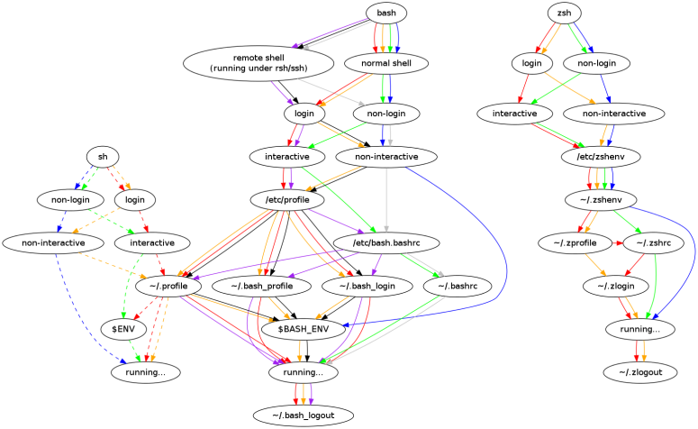

# ZSH Configuration Directory

Custom settings for my favorite shell to tinker with :)

These include:

- Respect the [XDG Base Directory Specification](\
https://specifications.freedesktop.org/basedir-spec/latest/) and
try to remove all the clutter from `$HOME`
- Minimal dependencies to always enjoy a fast prompt
- Some eye-candy tweaking
- Convenient features like branch name for Git, Python's virtualenvs, ...

There are still questions about to use a plugin manager or not, but I'd rather
avoid complexity, and just make something "static" and nice for my use case.


#### Inspiration list:

- [Pure](https://github.com/sindresorhus/pure)
- [Starship](https://starship.rs/)


## Role of each file and startup order

This section documents how the configuration was done,
according to the default subtilities of ZSH, and wanted behavior.

### Relevant ZSH manual sections

- [Startup files Intro](https://zsh.sourceforge.io/Intro/intro_3.html)
- [More about those files](https://zsh.sourceforge.io/Intro/intro_3.html)

### Really handy summary



### .zshenv

This file is read by **every** possible zsh shell so it should contain
as less commands as possible, to ensure a quick start up time.

As shown on the diagram above, and to ensure every zsh user on the system could
relocate all their configuration files to `$HOME/.config/zsh`
(XDG Base Dir Spec), one needs to set the default zsh config folder.

This is done through a ZSH internal variable as explained below.

```sh
# /etc/zsh/zshenv/:
ZDOTDIR="$HOME"/.config/zsh
```

From then, the system zsh shell will not look in `"$HOME"/.zshenv` anymore,
but would start reading the files in the order FROM `$HOME/.config/zsh`.

If this setting is not (or can not be) done for some reason, there must be
a remaining symbolic link in `$HOME` pointing to the XDG directory.

### .zprofile

This file is sourced after a succesful login.

Basically, this file is just to automatically run the graphical server if any,
so the user doesn't type `startx` at each "daily" login.

What if one sets environment variables here ?
Then anything modified here would require to log off and then log in again.
Also suppose a non-login, non-interactive shell process like a cronjob, then
it will completely ignore the variable set here. Is there any use case here ?

### .zshrc

Where all the magic happens!

(TODO: Document this file)

### .zlogout

Clear the terminal or any other resource acquired at login.

## Configuration file levels

In the idea:

00-* 'init' stage - variables that may be used in later scripts
or defaults that are going to be extended.

10-* vanilla zsh features configuration

20-* Use of plugins that enhance the vanilla experience

30-* Plugins that use or rely on other plugins or soft

50_* User mapping / merging of all of those into one customized experience

90+* The latest required by settings/plugins and so on


## Resources

Insert interesting resources here.
